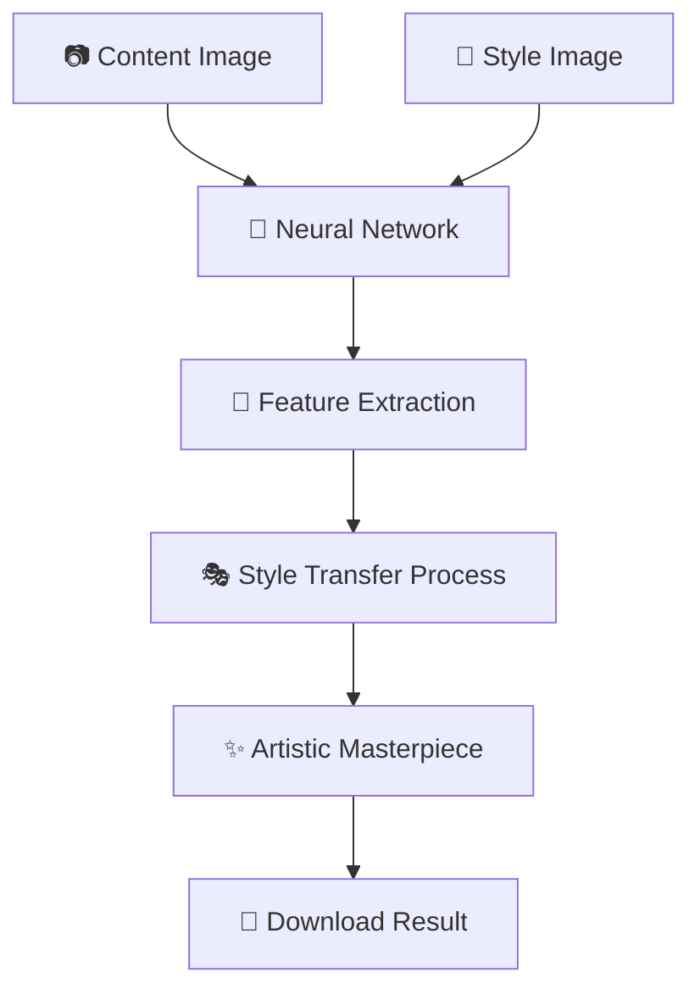

# 🎨✨ Neural Style Transfer Studio 🖼️🚀

<div align="center">
  
  
  [](https://your-app-url.streamlit.app/)
  
  
  
  
</div>

---

## 🌟 Overview

**Neural Style Transfer Studio** is a revolutionary Streamlit web application that transforms your ordinary photos into extraordinary artistic masterpieces! 🎭 Leveraging the power of deep learning and Neural Style Transfer, this app combines the content of one image with the artistic style of another, creating unique and visually stunning results that look like they were painted by famous artists.

<div align="center">
  
</div>

---

## ✨ Features

### 🖼️ **Flexible Image Processing**
- 📤 **Content Image Upload**: Easily upload any photograph you wish to transform
- 🎨 **Multiple Style Options**: Choose from predefined artistic styles or upload custom ones
- 👁️ **Real-time Preview**: See your content and style images instantly in the app

### 🎯 **Smart Style Selection**
- 🖌️ **Predefined Gallery**: Curated collection of famous artistic styles
- 🎪 **Custom Style Upload**: Use your own images as artistic styles
- 🔄 **Single or Multiple**: Apply one style or experiment with multiple styles simultaneously

### ⚙️ **Advanced Controls**
- 🎛️ **Quality Settings**: Adjust output resolution for optimal results
- 🌈 **Color Preservation**: Experimental feature to maintain original colors (beta)
- ⏱️ **Progress Tracking**: Visual feedback during the transformation process

### 💾 **Export & Download**
- 🖼️ **Individual Downloads**: Save each styled image as high-quality PNG
- 📦 **Batch Download**: Download all generated images as a convenient ZIP file
- 📊 **Organized Naming**: Automatically timestamped and labeled files

### 🎨 **User Experience**
- 🖥️ **Responsive Design**: Works beautifully on desktop, tablet, and mobile
- 🌟 **Professional UI**: Modern, intuitive interface with smooth animations
- ℹ️ **Informative Sections**: Built-in guide explaining Neural Style Transfer

---

## 🛠️ Technology Stack

<div align="center">

| Technology | Purpose | Version | Badge |
|------------|---------|---------|-------|
| **Streamlit** | Interactive Web Interface | 1.45.1 |  |
| **TensorFlow** | Deep Learning Framework | 2.18.0 |  |
| **TensorFlow Hub** | Pre-trained Models | 0.16.1 |  |
| **NumPy** | Numerical Computing | 2.0.2 |  |
| **Pillow** | Image Processing | 11.2.1 |  |

</div>

---

## 🚀 How Neural Style Transfer Works



### 🔬 **The Science Behind the Magic**

1. **🧠 Content Analysis**: The neural network analyzes the structural content of your photo
2. **🎨 Style Extraction**: Artistic patterns and textures are extracted from the style image  
3. **🔄 Feature Mixing**: Deep learning algorithms blend content structure with artistic style
4. **✨ Reconstruction**: A new image is generated combining both elements seamlessly

---

## 💻 Setup and Installation

### 📋 Prerequisites
- Python 3.8 or higher 🐍
- pip package manager 📦
- Internet connection (for model downloads) 🌐

### 🚀 Quick Start Guide

1. **📥 Clone the Repository**
   ```bash
   git clone https://github.com/HackWGaveesh/Neural-Style-Transfer-Studio.git
   cd Neural-Style-Transfer-Studio
   ```

2. **🐍 Create Virtual Environment** (Recommended)
   ```bash
   python -m venv venv
   
   # Windows
   venv\Scripts\activate
   
   # macOS/Linux
   source venv/bin/activate
   ```

3. **📦 Install Dependencies**
   ```bash
   pip install -r requirements.txt
   ```

4. **🎨 Prepare Style Images**
   ```bash
   # Create the Styles directory and add your style images
   mkdir Styles
   # Add your style images (vangogh.jpg, monet.jpg, etc.) to this folder
   ```

5. **🚀 Launch the Application**
   ```bash
   streamlit run StyleGan_Main.py
   ```

6. **🎉 Open in Browser**
   - The app will automatically open at `http://localhost:8501`
   - Start creating your artistic masterpieces!

---

## 📁 Project Structure

```
🎨 Neural-Style-Transfer-Studio/
├── 🚀 StyleGan_Main.py           # Main Streamlit application
├── 📋 requirements.txt           # Python dependencies
├── 🎨 Styles/                    # Predefined style images directory
│   ├── vangogh.jpg              # Van Gogh style
│   ├── monet.jpg                # Monet style
│   ├── picasso.jpg              # Picasso style
│   └── ...                      # Add more styles here
├── 📖 README.md                 # This file
├── 🙈 .gitignore               # Git ignore rules
└── 📄 LICENSE                  # License file
```

---

## 🎮 Usage Guide

### 📸 **Step 1: Upload Content Image**
1. Navigate to the **"📸 Upload & Create"** tab
2. Click **"Choose a content image"** to upload your photo
3. Supported formats: JPG, JPEG, PNG, WebP
4. Preview appears instantly with image dimensions

### 🎨 **Step 2: Select Artistic Style**

#### **Option A: Predefined Styles** 🖼️
1. Choose **"🎨 Predefined Styles"**
2. Select **"Single Style"** or **"Multiple Styles"** mode
3. Click on style thumbnails to select/deselect
4. See real-time selection feedback

#### **Option B: Custom Style** 🖌️
1. Choose **"🖌️ Custom Style"**
2. Upload your own artistic reference image
3. Any image can become a style template!

### ⚙️ **Step 3: Advanced Settings** (Optional)
- **🎛️ Output Quality**: Adjust from 1-10 (higher = better quality, larger files)
- **🌈 Color Preservation**: Experimental feature to maintain original colors

### 🖌️ **Step 4: Generate Artwork**
1. Click **"🖌️ Generate Artwork"** button
2. Watch the progress bar as your masterpiece is created
3. Processing time varies by image complexity

### 💾 **Step 5: Download Results**
- **Individual Download**: Save each styled image separately
- **📦 Batch Download**: Get all images in one ZIP file
- **🏷️ Auto-naming**: Files include style name and timestamp

---

## 🎨 Style Gallery Examples

<div align="center">

| Style | Preview | Description |
|-------|---------|-------------|
| 🌻 **Van Gogh** |  | Swirling brushstrokes and vibrant colors |
| 🏞️ **Monet** |  | Impressionist style with soft, blended colors |
| 🎭 **Picasso** |  | Cubist geometric forms and bold shapes |
| 🌊 **Hokusai** |  | Traditional Japanese woodblock print style |

</div>

---

## 🔧 Advanced Configuration

### 🎨 **Adding Custom Styles**
1. Add your style images to the `Styles/` directory
2. Supported formats: JPG, JPEG, PNG, WebP
3. Recommended resolution: 512x512 pixels or higher
4. Restart the app to see new styles in the gallery

### ⚡ **Performance Optimization**
- **GPU Acceleration**: TensorFlow automatically uses GPU if available
- **Memory Management**: Large images are automatically resized for processing
- **Batch Processing**: Multiple styles processed efficiently

### 🔧 **Troubleshooting**
- **Model Loading Issues**: Ensure stable internet connection for initial model download
- **Memory Errors**: Try reducing image size or output quality
- **Style Not Appearing**: Check image format and restart application

---

## 🤝 Contributing

We welcome contributions from the community! 🎉 Here's how you can help:

### 🌟 **Ways to Contribute**
- 🐛 **Bug Reports**: Found an issue? Open an issue with details
- ✨ **Feature Requests**: Suggest new features or improvements  
- 🎨 **Style Gallery**: Share interesting style images
- 📚 **Documentation**: Help improve our guides and tutorials
- 💻 **Code Contributions**: Submit pull requests with enhancements

### 🚀 **Development Setup**
1. Fork the repository
2. Create a feature branch: `git checkout -b feature/amazing-feature`
3. Make your changes and test thoroughly
4. Commit changes: `git commit -m 'Add amazing feature'`
5. Push to branch: `git push origin feature/amazing-feature`
6. Open a Pull Request with detailed description

### 💡 **Ideas for Contributions**
- 🎭 Additional neural style transfer models
- 🎨 Style mixing and blending features
- 📱 Mobile app version
- 🔄 Video style transfer capabilities
- 🖼️ Batch processing for multiple images
- 🎛️ More advanced parameter controls

---

## 📄 License

This project is licensed under the MIT License - see the [LICENSE](LICENSE) file for details.

---

## 🙏 Acknowledgments

- 🧠 **Google Research** for the Arbitrary Image Stylization model
- 🎨 **TensorFlow Hub** for providing pre-trained models
- 🚀 **Streamlit** team for the amazing web framework
- 🎭 **Art Community** for inspiring styles and creativity
- 👨‍💻 **Open Source Community** for continuous inspiration

---

## 📊 Performance Metrics

<div align="center">

| Metric | Value |
|--------|-------|
| ⚡ Average Processing Time | 15-30 seconds |
| 🖼️ Supported Image Formats | JPG, PNG, WebP |
| 📏 Max Image Resolution | 4K (4096x4096) |
| 🎨 Available Styles | 10+ predefined |
| 💾 Output Format | High-quality PNG |

</div>

---

## 🔗 Useful Links

- 📚 [Neural Style Transfer Paper](https://arxiv.org/abs/1508.06576)
- 🤖 [TensorFlow Hub Model](https://tfhub.dev/google/arbitrary-image-stylization-v1-256/2)
- 🎨 [Streamlit Documentation](https://docs.streamlit.io/)
- 🧠 [Deep Learning Resources](https://www.tensorflow.org/tutorials)

---

## 📝 Notes & Tips

### 🎯 **For Best Results**
- 📸 Use high-resolution, well-lit content images
- 🎨 Choose style images with distinct artistic characteristics
- ⚙️ Experiment with different quality settings
- 🔄 Try multiple styles to find your favorite combination

### ⚠️ **Known Limitations**
- 🕒 Processing time increases with image size
- 💾 Large images may require more memory
- 🌈 Color preservation is experimental and may not work perfectly
- 🖥️ GPU acceleration recommended for large batches

---

<div align="center">

## 💬 Get in Touch

Questions? Suggestions? Just want to share your amazing creations? 

[](https://github.com/HackWGaveesh)
[](mailto:gaveeshags2004@gmail.com)

---

**⭐ If this project inspired you to create amazing art, please give it a star! ⭐**

*Transform your world through the lens of artificial intelligence and artistic creativity* 🌈✨

---

<p align="center">
  
</p>

**Created with ❤️ by HackWGaveesh**

</div>
